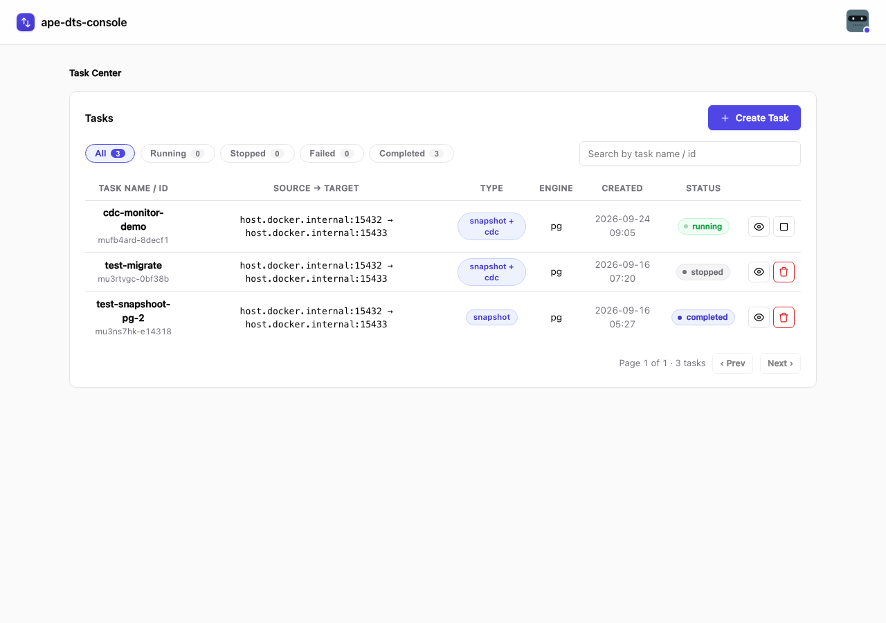
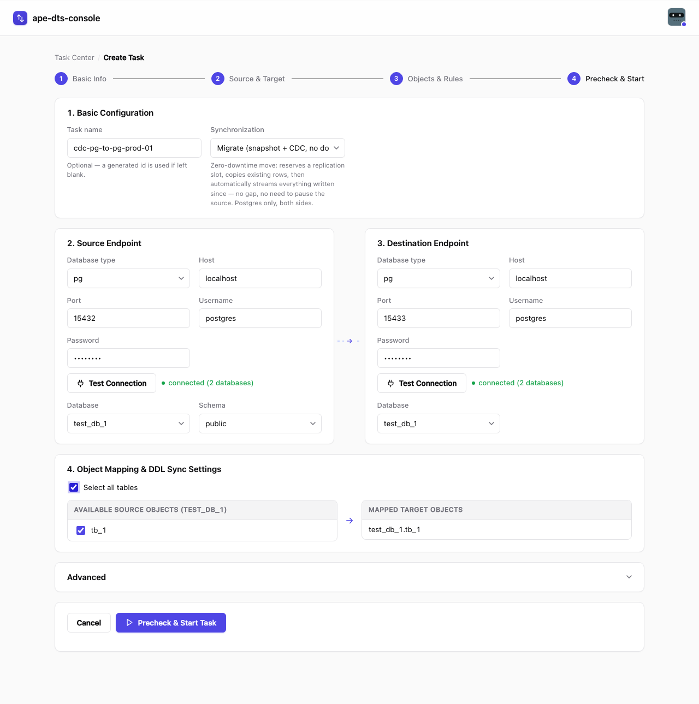
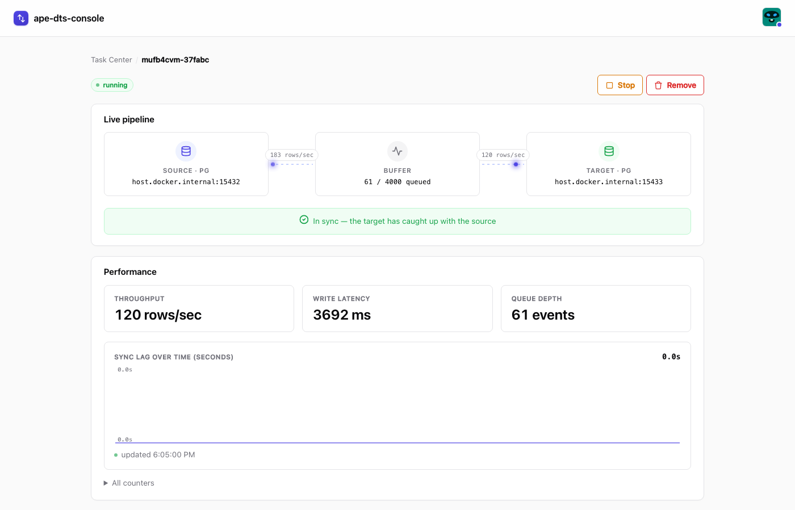

# ape-dts-console

Local web UI for [ape-dts](https://github.com/apecloud/ape-dts): build a `task_config.ini`
through a form, run it as a Docker container, and watch it live — throughput, sync lag, and
row-level data verification — without touching the CLI or the ini format by hand.

No build step, no framework, no external JS dependencies in the browser. Static HTML/CSS/JS served
by a small Express server that also drives Docker and tails log files.

### This repo is UI only — the engine comes from a Docker image, not a clone

This repository does **not** contain the [ape-dts](https://github.com/apecloud/ape-dts) engine
source code, and cloning it does not clone the engine too. The engine ships as a prebuilt Docker
image, `apecloud/ape-dts:2.0.22` (version pinned in `lib/docker.js`) — when you start a task from
the UI, the Node server just runs `docker run` with that image and a generated `task_config.ini`.
Docker pulls the image from Docker Hub automatically the first time it's needed (or pull it
yourself ahead of time: `docker pull apecloud/ape-dts:2.0.22`). You never need to build or clone
the engine to use this UI.

## Screenshots

| Task Center | Create Task | Monitoring a running task |
|---|---|---|
|  |  |  |

## Prerequisites

- Node.js (18+)
- Docker, running and reachable from this machine (`docker ps` must work), with network access to
  pull images from Docker Hub the first time a task runs
- Network access from inside Docker containers to your source/target databases — see
  [host.docker.internal](#hostdockerinternal-quirk) below

## Run it

```bash
git clone <this-repo-url>
cd ape-dts-console
npm install
npm start          # http://localhost:8787
```

First run walks you through creating an admin account (see [Security](#security)) — no separate
engine install step. The pinned `apecloud/ape-dts` image is pulled automatically the first time
you start a task.

## What it does

| Page | What you get |
|---|---|
| **Create Task** | Pick source/target DB (Postgres, MySQL, MongoDB), test the connection, pick tables, choose a sync mode, start it as a Docker container running the pinned `apecloud/ape-dts` image. |
| **Task Center** | List of all tasks with status (running/completed/failed/stopped), search, and quick actions (stop/remove). |
| **Task Detail** | Live pipeline diagram (source → buffer → target), throughput/lag metrics charted over time, and an on-demand data-verification pass (`sink_type=check`) that diffs every row on the source against the target. |

### Sync modes

| Mode | DB support | Pre-existing rows | Ongoing changes | Downtime / gap |
|---|---|---|---|---|
| **Real-time Incremental (CDC)** | Postgres, MySQL, MongoDB | ❌ not copied | ✅ streamed live from task start | No gap on new writes, but anything already in the source before start is skipped |
| **Full copy (snapshot)** | Postgres, MySQL, MongoDB | ✅ copied once | ❌ not captured | One-time copy only — run a CDC task afterwards for ongoing replication |
| **Migrate (snapshot + CDC, no gap)** | **Postgres only, both sides** | ✅ copied | ✅ streamed from the snapshot's exact LSN | Zero-downtime, zero gap |

The migrate mode reserves the replication slot and captures its LSN *before* the snapshot reads a
single row, runs the snapshot, then automatically starts a CDC task from that exact LSN once the
snapshot completes — so nothing written during the snapshot is lost. Shows as **one row** in Task
Center (the CDC phase runs as a hidden child task, `migrateOf`); Task Detail shows both phases and,
if the snapshot phase fails, the replication slot is left alive on purpose (with the manual drop
SQL shown) so a retry loses nothing. Implements the manual procedure documented in
`ape-dts/docs/en/tutorial/snapshot_and_cdc_without_data_loss.md` — pre-create slot, capture LSN,
snapshot, then CDC with `start_lsn` set — automatically (`lib/pgslot.js`, `reconcileStatuses()` in
`server.js`).

## Step-by-step: create a task

1. Open `http://localhost:8787`, click **Create Task**.
2. **Basic Configuration** — optionally set a task name (a generated id is used if left blank),
   pick **Synchronization**: `Real-time Incremental (CDC)`, `Full copy (snapshot)`, or `Migrate
   (snapshot + CDC, no downtime)` (Postgres-only, disabled unless both source and target are set to
   Postgres) — see [Sync modes](#sync-modes) above for what each one actually does.
3. **Source Endpoint** — pick the database type, fill Host/Port/Username/Password, click
   **Test Connection**. If the source runs on your machine, just use `localhost` — the server
   auto-rewrites it to `host.docker.internal` for the task container, see
   [host.docker.internal quirk](#known-limitations).
   - Once connected, pick a **Database** (and, for Postgres, a **Schema** — defaults to `public`).
4. **Object Mapping** — check the tables you want to sync in the left column; they mirror into
   the right column under the destination database name (ape-dts writes to the same table name it
   reads — no renaming). Leaving all tables unchecked syncs the whole database.
5. **Destination Endpoint** — same as step 3 (no table picker; it just needs a Database).
   Target tables must already exist — this UI does not create schema.
6. If the destination is MySQL, an **Enable DDL synchronization** checkbox appears — turn it on
   only if you also want `create/alter/drop table` statements replicated.
7. *(Optional)* Open **Advanced** to load a preset, tune fields like batch size or parallelism, or
   pick a **Docker network** (leave empty for external DBs / RDS; `--network host` is unreliable
   under Colima).
8. Click **Precheck & Start Task**. Validation errors (if any) show under the button; fix and
   retry. On success you land on **Task Detail**.
9. Watch **Live pipeline** — it reads "waiting…" until the first real event lands, then flips to
    "in sync" (CDC) or runs to completion (snapshot, status becomes `completed`). Use
    **Data Verification** any time to diff every source row against the target.
10. Task done or no longer needed? Go to **Task Center**, use **Stop** then **Remove** — this also
    deletes the container and its generated `runs/<id>/` directory (config + logs), the same cleanup
    the upstream engine's own `dtscli delete` does.

## Security

Login is required. On first run, with no accounts yet, the app forces the first visitor through
a "create admin account" page instead of leaving Docker control open to anyone who can reach it.
That admin can then add more accounts (admin or standard user) from the "Manage users" link in
the header, or you can seed one from the CLI:

```
node scripts/add-user.js <username> <password> [admin|user]
```

Accounts live in `auth/users.json` (git-ignored, scrypt-hashed passwords, never plaintext).
Sessions are signed cookies, not a server-side store — set `SESSION_SECRET` to a random
persistent value, or restarting the app logs everyone out. It still binds to `127.0.0.1` by
default (localhost-only) as a second layer; set `HOST=0.0.0.0` only if you actually want
LAN/remote access.

State-changing requests (anything but GET) are also rejected if their `Origin`/`Referer` isn't
this app's own origin, to stop a malicious webpage open in the same browser from silently
POSTing here — but this is a drive-by mitigation, not real auth.

Database credentials entered in the UI are written in plaintext to `runs/<id>/task_config.ini`
on disk (bind-mounted into the task's container) — that directory is `.gitignore`d so it never
gets committed, but it's still plaintext on your filesystem for as long as the task exists.
**Remove** in Task Center deletes that directory (config + logs) along with the container, so
credentials don't linger after you're done with a task.

## Known limitations

- **`host.docker.internal` quirk** — Test Connection runs from the Node server process on the
  *host*, but the actual task runs *inside* a container, where `localhost` resolves to the
  container itself, not your machine. The server auto-rewrites `localhost`/`127.0.0.1` to
  `host.docker.internal` in the URL it writes into the task's `task_config.ini`
  (`lib/docker.js`'s `dockerizeUrl`) — so filling `localhost` in the form just works. Any other
  hostname (a real DB, RDS, etc.) is left untouched.
- **PG replication drop ends the engine's own task, but the UI auto-retries CDC** — if the Postgres
  logical replication stream drops (DB restart, network blip), the pinned engine image ends the
  task rather than reconnecting itself; this is an upstream engine limitation, not a bug in this UI
  (see `lib/retry.js`). To work around it, the status reconciler in `server.js` detects a `cdc` task
  that failed with a transient-looking error (connection reset/closed, broken pipe, replication
  stream error — see `TRANSIENT_PATTERNS` in `lib/retry.js`) and restarts the same container, up to
  `MAX_RETRIES` (5) times; `meta.retryCount` is shown in Task Center as `· auto-retried Nx`. A
  failure that doesn't match those patterns (bad credentials, missing table, ...) is left `failed`
  on purpose — retrying a permanent misconfiguration would just crash-loop.
- Pinned engine image: `apecloud/ape-dts:2.0.22` (`lib/docker.js`) — some newer engine features
  (e.g. `[checker]` ini section, `connection_auth_config`) intentionally aren't used because this
  version predates them.

## Project layout

```
server.js        Express app: REST API, task lifecycle, Docker orchestration, status polling
lib/             Pure/IO helpers used by server.js (ini parsing+validation, log tailing/parsing,
                 check-log aggregation, docker exec wrapper, connection introspection,
                 CDC auto-retry classification)
public/          Browser app — index.html + app.js (page controllers) + formdata.js/view.js
                 (pure helpers, also required directly from tests)
schema.json      Single source of truth for ini shape: sections, fields, enums, per-extract-type
                 required keys, form presets
test/            node:test suite (`npm test`), zero external test-framework deps
runs/            Generated per-task dir: task_config.ini + logs/ (bind-mounted into the container)
```

## Testing

```bash
npm test
```

Pure logic (ini round-tripping, form building, log-line parsing, status transitions) is unit
tested. There is no automated UI/browser test — verify UI changes by hand against a running
`npm start` and a real Docker + database setup.

## License

[MIT](LICENSE)
